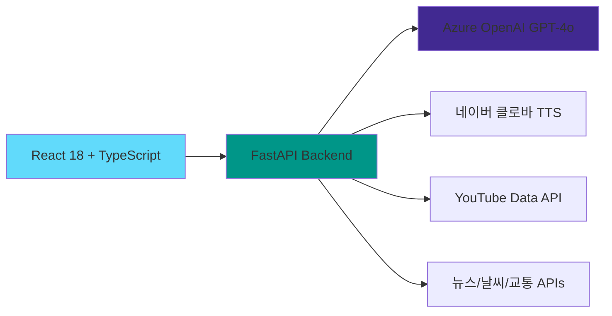
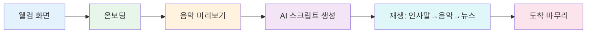

<div align="center">


# ONAIR 🎙️

**출근길을 위한 개인 맞춤형 AI 라디오**

[](https://cursor.sh)
[](https://python.org)
[](https://reactjs.org)
[](https://typescriptlang.org)

날씨, 뉴스, 음악을 제공하며, 실시간 교통 정보와 함께<br/>출근길을 더 즐겁게 만들어드립니다.

[데모 보기](#-사용-흐름) • [빠른 시작](#-빠른-시작) • [기술 스택](#-기술-스택)

</div>

---

## ✨ 주요 기능

### 🎙️ **AI 라디오**
> Azure OpenAI 기반 개인 맞춤형 라디오 스크립트

- 💬 **개인 맞춤 인사말** - 날씨와 이름을 포함한 자연스러운 인사
- 🌤️ **실시간 날씨 안내** - Open-Meteo API 기반 정확한 날씨 정보
- 📰 **관심 뉴스 브리핑** - 선택한 카테고리의 최신 뉴스 3건
- 🔊 **자연스러운 TTS 음성** - 네이버 클로바 TTS Premium

### 🎵 **스마트 음악 추천**
> 상황에 맞는 음악을 자동으로 선곡

- 🌦️ **날씨/시간대별 추천** - 비오는 날엔 재즈, 아침엔 경쾌한 음악
- 🎼 **무드별 플레이리스트** - 10가지 다양한 음악 분위기
- ▶️ **끊김 없는 자동 재생** - YouTube 음악 스트리밍

### 🚇 **실시간 교통 정보**
> 출근길 대중교통 경로와 도착 시간

- 🗺️ **대중교통 경로 안내** - 집에서 회사까지 최적 경로 (ODsay API)
- ⏱️ **지하철 실시간 도착** - "3분 후 도착" 실시간 정보
- 💰 **소요시간 및 요금** - 총 소요시간, 환승 횟수, 교통비

### ⚙️ **개인화 설정**
> 나만의 출근길 라디오 만들기

- 🎤 **DJ 선택** - 커돌이(남성) / 커순이(여성) 성우 선택
- 📑 **뉴스 카테고리** - 정치, 경제, 사회, 문화, 세계, 기술, 엔터, 예술
- 🎚️ **라디오:음악 비율** - 1:1부터 5:1까지 자유롭게 조절

---

## 🏗️ 기술 스택



<div align="center">

| 분야 | 기술 |
|:---:|:---|
| **Frontend** | React 18, TypeScript, Vite, Tailwind CSS |
| **Backend** | Python 3.10+, FastAPI, httpx |
| **AI** | Azure OpenAI (GPT-4o), 네이버 클로바 TTS Premium |
| **APIs** | YouTube Data v3, 딥서치 뉴스, Open-Meteo, Kakao 로컬, ODsay, 서울시 공공데이터 |

</div>

---

## 🚀 빠른 시작

### 📋 사전 준비

<details>
<summary><b>필수 API 키 발급</b></summary>

#### 1. Azure OpenAI (필수)
- [Azure Portal](https://portal.azure.com) 접속
- OpenAI 리소스 생성
- 엔드포인트 및 API 키 복사

#### 2. 네이버 클로바 TTS (필수)
- [NCP Console](https://console.ncloud.com) 접속
- Clova Voice → TTS Premium 신청
- Client ID 및 Secret 발급

#### 3. 선택 API (기능 향상)
- **YouTube**: [Google Cloud Console](https://console.cloud.google.com)
- **뉴스**: [딥서치](https://news.deepsearch.com/get-api-key/)
- **교통**: [Kakao Developers](https://developers.kakao.com), [ODsay API](https://lab.odsay.com)

</details>

### ⚡ 설치 및 실행

```bash
# 1. 저장소 클론
git clone https://github.com/chanbyeong0/hiradio.git
cd hiradio

# 2. 환경 변수 설정
cp .env.template .env
# .env 파일에 API 키 입력

# 3. 백엔드 실행
python3 -m venv venv
source venv/bin/activate  # Windows: venv\Scripts\activate
pip install -r requirements.txt
uvicorn backend.main:app --reload --host 0.0.0.0 --port 9100

# 4. 프론트엔드 실행 (새 터미널)
cd frontend
npm install
npm run dev
```

**🎉 완료!** `http://localhost:5173` 접속

---

## 📱 사용 흐름



1. **온보딩** → 이름, 출발지, 도착지, DJ, 관심 뉴스 설정
2. **미리보기** → 첫 곡 선택
3. **로딩** → AI가 개인 맞춤 스크립트 생성 중
4. **재생** → 인사말 🎙️ → 음악 🎵 → 뉴스 📰 → 음악 🎵 (반복)
5. **도착** → 마무리 인사 및 종료

---

## 📂 프로젝트 구조

```
hiradio/
├── 📁 backend/
│   ├── main.py              # FastAPI 서버 (1,464 lines)
│   └── core/config.py       # 환경 변수 관리
├── 📁 frontend/
│   ├── 📁 src/
│   │   ├── 📁 components/   # React 컴포넌트 (6개 화면)
│   │   ├── api.ts           # API 클라이언트
│   │   ├── types.ts         # TypeScript 타입
│   │   └── utils/           # 유틸리티 함수
│   └── package.json
├── .env.template            # 환경 변수 템플릿
├── requirements.txt         # Python 패키지
└── README.md
```

---

## 🐛 문제 해결

<details>
<summary><b>YouTube API 403 에러</b></summary>

```bash
# 해결 방법:
1. Google Cloud Console → YouTube Data API v3 활성화
2. API 키 제한 확인 (IP/도메인 제한 해제)
3. 할당량 확인 (일일 10,000 units)
```
</details>

<details>
<summary><b>TTS 재생 안 됨</b></summary>

- 네이버 클로바 TTS API 키 확인
- 브라우저 자동 재생 정책 (사용자 인터랙션 필요)
- 네트워크 연결 확인
</details>

<details>
<summary><b>경로 검색 실패</b></summary>

- ODsay API 키 확인
- Kakao REST API 키 확인
- 장소명을 정확히 입력 (예: "강남역", "서울역")
</details>

---

## 🔒 보안

> ⚠️ **중요**: `.env` 파일을 절대 Git에 커밋하지 마세요!

- ✅ `.env` 파일은 `.gitignore`에 포함됨
- ✅ 모든 API 키는 환경 변수로 관리
- ✅ 프론트엔드에서는 백엔드를 통해서만 API 호출

---

## 📄 라이선스

MIT License - 자유롭게 사용, 수정, 배포할 수 있습니다.

---

<div align="center">

### 💝 Made with Love

**Cursor Hackathon 2025**

[](https://github.com/chanbyeong0)
[](https://cursor.sh)

*출근길이 즐거워지는 순간, ONAIR와 함께* ✨

</div>
